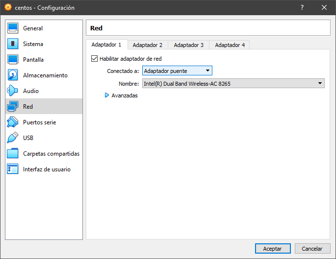
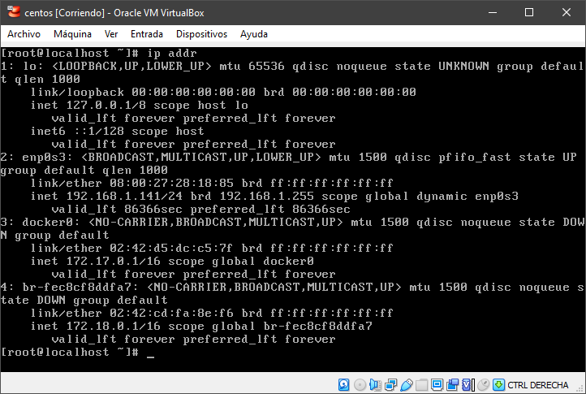

[](http://www.fiware.zone)

# Despliegue de Context Broker y uso de la plataforma Thinking Cities
Este tutorial es una introducción al despliegue de un Context Broker en un entorno local y el uso de la plataforma Thinking Cities de Telefónica como plataforma comercial FIWARE.

# Prerequisitos

Antes de poder seguir con este curso, es necesario cumplir con varias condiciones, tenienodo que tener instalados diversos programas.

## Postman

Postman es un cliente de peticiones HTTP, que nos permitirá interactuar con la API NGSI de una forma gráfica, sencilla e intuitiva. Para obtener más información sobre como instalar y configurar Postman, así como para descargar la colección de peticiones y el fichero de variables de entorno, haz click [aquí](postman/README.md). También puedes descargar los ficheros a continuación:

- [Colección de peticiones](https://raw.githubusercontent.com/FIWAREZone/tutorial.despliegue-context-broker/master/postman/FIWARE%20Zone%20Course.postman_collection.json)
- [Fichero de entorno](https://raw.githubusercontent.com/FIWAREZone/tutorial.despliegue-context-broker/master/postman/FIWARE%20Zone%20Course%20Enviroment%20Template.postman_environment.json)

## Entorno donde correr Docker

Existen varios métodos para poder ejecutar docker en su equipo. Si usted está utilizando una distribución Linux, seguramente pueda instalar sin ningún tipo de problema Docker de forma Nativa. 

A continuación se enlazan las guías de instalación de docker para los distintos sistemas operativos:
- **Linux**. Dependiendo de la distribución tienen guías distintas:
   - **Centos** https://docs.docker.com/install/linux/docker-ce/centos/
   - **Debian** https://docs.docker.com/install/linux/docker-ce/debian/
   - **Ubuntu** https://docs.docker.com/install/linux/docker-ce/ubuntu/

- **Windows**: https://docs.docker.com/docker-for-windows/install/
- **MacOS**: https://docs.docker.com/docker-for-mac/install/

Además de Docker, también será necesario disponer instalado de Docker-Compose. Tanto en Windows como en MacOS, Docker-Compose se instala con la instalación de Docker Desktop. Para linux podemos seguir las instrucciones reflejadas en la [guía](https://docs.docker.com/compose/install/).


Para que el tutorial sea lo más homogéneo posible, vamos a instalar docker y docker-compose sobre una máquina virutal. Así, la ejecución de este tutorial será totalmente independiente del sistema operativo (huesped) y de la máquina en la que se corre.

# Instalación máquina virtual con Linux

## Descarga e instalación de Virtualbox

Es necesario de disponer de un software de virtualización para correr una máquina virtual dentro del sistema operativo. En este caso se recomienda usar Virtualbox puesto que es Open Source. Se puede descargar desde [aquí](https://www.virtualbox.org/wiki/Downloads
).

## Descarga de Centos y creación de la máquina virtual

En este caso queremos que la propia máquina virtual tenga una IP propia, por lo que en configuraciónes de red vamos a elegir la opción de `Adaptador de puente` o `Bridge`



## Conexión a la máquina virtual y primeros pasos
Dado que Centos no se conecta de forma automática a la red, vamos a ejecutar el cliente DHCP para que la máquina obtenga IP.

```console
dhclient
```

A continuación vamos a comprobar la IP que tiene la máquina virtual para poder conectarnos por SSH.

```console
ip addr
```

La respuesta al comando debe ser algo similar a la siguiente imagen



De ella podemos deducir que la IP de la máquina es, para este ejemplo, `192.168.1.141`. Una vez conocemos la IP de la máquina, abrimos una sesión SSH, para ello, en Windows podemos usar Símbolo de Sistema o PowerShell. Tanto en Linux como en MacOS, podemos usar la consola de comandos.

```console
ssh user@domain
```

Donde `user` será el usuario con el que hemos creado la cuenta al hacer la instalación del sistema operativo y `domain` la IP que hemos obtenido en el paso anterio.

Una vez tengamos acceso, aprovechamos para instalar wget, que será utilizado más adelante para descargar el fichero docker-compose.yml, de la siguiente manera

```console
yum install wget
```


## Instalación de Docker y Docker-Compose en la máquina virtual

Es necesario disponer de Docker y Docker compose dado que vamos a lanzar los servicios contenedorizados. Una vez podemos acceder a la máquina debemos seguir los siguientes pasos:

### Instalar instalar docker y lanzar servicio. 
Primero instalamos docker

```console
yum install docker
```
Lanzamos los servicios de sistema

```console
systemctl enable docker
systemctl start docker
```
Comprobamos que Docker funciona correctamente

```console
docker info
```

### Instalar docker-compose

Descargamos Docker-Compose y le damos permisos de ejecución:

```console
sudo curl -L “https://github.com/docker/compose/releases/download/1.25.0/docker-compose-$(uname -s)-$(uname -m)" -o /usr/local/bin/docker-compose
sudo chmod +x /usr/local/bin/docker-compose
```

# Despliegue de Orion Context Broker

Antes de nada debemos descargarnos el fichero docker compose con el que vamos a desplegar el context broker

```console
wget https://raw.githubusercontent.com/telefonicaid/fiware-orion/master/docker/docker-compose.yml
```
El fichero que acabamos de descargar es el siguiente:

```yml
mongo:
  image: mongo:3.6
  command: --nojournal

orion:
  image: fiware/orion
  links:
    - mongo
  ports:
    - "1026:1026"
  command: -dbhost mongo

```

En el podemos ver los 2 contenedores que se van a desplegar, por un lado Orion, y por otro MongoDB, que es la base de datos que emplea el Orion Context Broker para la persistencia de los datos.

Para lanzar los contenedores solo tenemos que ejecutar el siguiente comando, siempre y cuando estemos en el mismo directorio que el fichero docker-compose.yml que queremos lanzar

```console
docker-compose up
```

Alternativamente, para lanzarlo en segundo plano, su puede usar:

```console
docker-compose up -d
```


## Comprobar que Orion funciona correctamente
Desde el navegador
Acceder a http://{{IP_VM}}:1026/version

Desde el terminal, en la propia máquina virtual, podemos comprobarlo de la siguiente manera:

```console
curl -X GET  'http://localhost:1026/version'
```

# Haciendo peticiones a la API NGSI

Vamos a emplear la API NGSI V2 para hacer las peticiones. La documentación de referencia la podemos encontrar [aquí](Daniel Villalba
    http://telefonicaid.github.io/fiware-orion/api/v2/stable/
https://fiware-orion.readthedocs.io/en/master/user/walkthrough_apiv2/index.html)


## Crear de una entidad

Vamos a crear nuestra primera entidad en el context broker. Esta entidad será de tipo coche o `Car`, con el identificador `entity-id:001` y con 3 atributos: 
- `brand` de tipo texto, con valor `Seat`
- `model` de tipo texto, con valor `Leon`
- `name` de tipo texto, con valor `Vehículo de antonio` 

Para ello ejecutamos el siguiente comando:

```console
curl -iX POST 'http://localhost:1026/v2/entities' \
-H 'Content-Type: application/json' \
-d '
{
    "id": "entity-id:001",
    "type": "Car",
    "brand": {
        "type": "Text",
        "value": "Seat"
    },
    "model": {
        "type": "Text",
        "value": "Leon"
    },
    "name": {
        "type": "Text",
        "value": "Vehículo de Antonio"
    }
}'
```

El terminal nos devolvera la siguiente respuesta en la que podemos apreciar que la petición se ha ejecutado correctamente, devolviendonos un código de respuesta `201`

```
HTTP/1.1 201 Created
Connection: Keep-Alive
Content-Length: 0
Location: /v2/entities/entity-id:001?type=Car
Fiware-Correlator: 4905034e-7f3b-11ea-b71c-0242ac120003
Date: Wed, 15 Apr 2020 17:05:19 GMT
```

## Añadir un atributo a la entidad

Para añadir un atributo a la entidad debemos hacer un `POST` a `/v2/entities/{{entity-id}}` donde `{{entity-id}}` es el identificador de la entidad que queremos modificar, en este caso, `entity-id:001`. El nuevo atributo a añadir se pasa en el cuerpo de la petición, en este caso se añade un nuevo atributo `location`. En caso de que el atributo ya exista, con esta petición lo va a sobreescribir. 

```console
curl -iX POST 'http://localhost:1026/v2/entities/entity-id:001/attrs' \
-H 'Content-Type: application/json' \
-d '
{
    "location": {
        "type": "geo:json",
        "value": {
             "type": "Point",
             "coordinates": [13.3986, 52.5547]
        }
    }
}'
```

La respuesta del servidor debe ser un código 204

```
HTTP/1.1 204 No Content
Connection: Keep-Alive
Content-Length: 0
Fiware-Correlator: 633ffc30-8a28-11ea-9e6a-0242ac120003
Date: Wed, 29 Apr 2020 14:47:45 GMT
```


## Leer las entidades almacenadas

Para leer todas las entidades debemos hacer una petición GET a /v2/entities como se muestra a continuación: 

```console
curl -iX GET 'http://localhost:1026/v2/entities'
```

La respuesta nos devolverá un código 200 y un array JSON con las entidades disponibles en el Context Broker, tal y como se puede ver a continuación.

```console
HTTP/1.1 200 OK
Connection: Keep-Alive
Content-Length: 313
Content-Type: application/json
Fiware-Correlator: 7ab153e8-7f3b-11ea-80ad-0242ac120003
Date: Wed, 15 Apr 2020 17:06:42 GMT

[{"id":"entity-id:001","type":"Car","brand":{"type":"Text","value":"Seat","metadata":{}},"model":{"type":"Text","value":"Leon","metadata":{}},"name":{"type":"Text","value":"Vehículo de Antonio","metadata":{}},"location":{"type":"geo:json","value":{"type":"Point","coordinates":[13.3986,52.5547]},"metadata":{}}}]
```

Si damos formato a los datos de la respuesta de la petición, para que sea más sencillo de leer, podemos ver que es la entidad que hemos creado anteriormente, junto a las modificaciones que hemos hecho sobre ella.

```json
[
  {
    "id": "entity-id:001",
    "type": "Car",
    "brand": {
      "type": "Text",
      "value": "Seat",
      "metadata": {}
    },
    "model": {
      "type": "Text",
      "value": "Leon",
      "metadata": {}
    },
    "name": {
      "type": "Text",
      "value": "Vehículo de Antonio",
      "metadata": {}
    },
    "location": {
      "type": "geo:json",
      "value": {
        "type": "Point",
        "coordinates": [
          13.3986,
          52.5547
        ]
      },
      "metadata": {}
    }
  }
]
```


## Borrar una entidad

Para borrar una etidad sólamente hay que hacer una petición DELETE a /v2/entities/{{entity-id}}

```console
curl -iX DELETE 'http://localhost:1026/v2/entities/entity-id:001'
```

En este caso, el servidor nos debe devolver un código 204

```
HTTP/1.1 204 No Content
Connection: Keep-Alive
Content-Length: 0
Fiware-Correlator: 5842c690-8a29-11ea-a7ab-0242ac120003
Date: Wed, 29 Apr 2020 14:54:36 GMT
```


